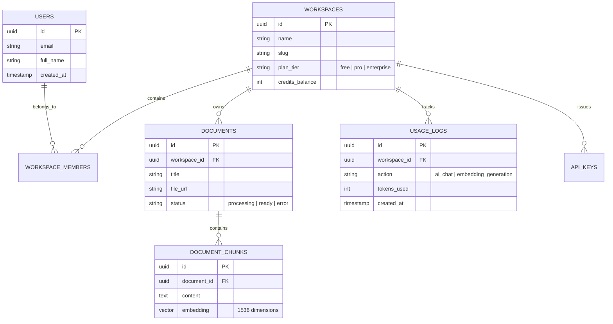

# 🧠 AI SaaS Multi-Tenant Database Architecture

Core database architecture designed for a multi-tenant AI Knowledge and Document Management SaaS. Built with **TypeScript**, **PostgreSQL**, **Drizzle ORM**, and **pgvector** for native vector similarity search.

---

## 🎯 Architecture Overview



---

## 🚀 Tech Stack

* **Language:** [TypeScript](https://www.typescriptlang.org/)
* **Database:** [PostgreSQL](https://www.postgresql.org/) with `pgvector` extension
* **ORM:** [Drizzle ORM](https://orm.drizzle.team/)
* **Migration & Tooling:** `drizzle-kit` & `tsx`
* **Validation:** [Zod](https://zod.dev/)

---

## 📂 Project Structure

```
├── src/
│   └── db/
│       ├── schema.ts         # Table definitions, relations, enums & vector extensions
│       ├── index.ts          # PostgreSQL connection & Drizzle instance
│       ├── seed.ts           # Realistic test data generator
│       └── queries.ts        # Production-grade query examples & semantic search
├── drizzle/                  # Auto-generated SQL migrations
├── drizzle.config.ts         # Drizzle Kit CLI configuration
├── tsconfig.json             # TypeScript compiler settings
└── package.json              # Scripts & dependencies
```

---

## 🛠️ Getting Started

### 1. Install Dependencies
```bash
npm install
```

### 2. Configure Environment Variables
Copy `.env.example` to `.env` and set your PostgreSQL connection string:
```bash
cp .env.example .env
```

### 3. Generate Migrations
```bash
npm run db:generate
```

### 4. Open Drizzle Studio (Visual DB GUI)
```bash
npm run db:studio
```

---

## 👤 Author
Developed by **Heitor Batazza** as part of the AI-Native Full Stack Engineering track.
